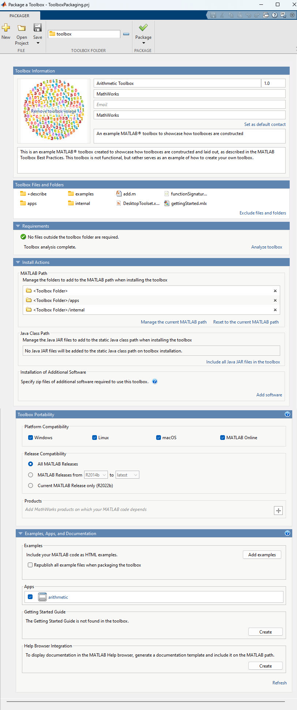

# MATLAB Toolbox Best Practices

 

You have a MATLAB&reg; toolbox that you want to share with the world. We want to help. To do that, we want to convince you to use the MathWorks Toolbox best practices. It's a little bit of extra work with a big payoff.

This is a continuously evolving document and some best practices may change in the future as MATLAB evolves. We encourage your feedback and suggestions for future revisions. Feel free to [open an issue](https://github.com/mathworks/toolboxdesign/issues) or [post to the discussions](https://github.com/mathworks/toolboxdesign/discussions). Your insights and feedback help us improve this document and make it even more useful for the community.  Right now, we're focused on toolboxes that don't have derived files that require a build step, like MEX files or content-obscured files (P-Code).  We plan to address those in the future.

Being in a standard format makes it easier for other people to assess and take advantage of your work. Your work is more "legible," because it's in a familiar format. They know, for example, that they can always expect to find a helpful and thorough `README.md` file in the top folder. They also know that a good place to start learning how to use your toolbox will be the `GettingStarted.mlx` file. These and other best practices help your users build confidence that your toolbox is well built and ready to use.

But the advantages go beyond helping your users. Standard formats also make it easier for you to maintain the toolbox. Tools and systems (such as automated testing on GitHub) will immediately know how to work.

We use the term “toolbox” here to mean a collection of reusable MATLAB code that you want to share with other people. Toolboxes contain not just code files, but also data, apps, tests, and examples. Some toolboxes will be just a few files; others may be extensive and represent years of effort by multiple people. The guidelines we present can be adapted for toolboxes that are large or small, casual or sophisticated. We will step through a comprehensive example with many aspects. There’s no need to do everything all at once -- you can start with a few guidelines and adopt more as you go.

To make it easier to follow, we’ve created a fictitious toolbox for doing basic arithmetic: The Arithmetic Toolbox on [GitHub](https://github.com/mathworks/arithmetic). We’ll use this throughout to show how to apply these design principles.  If you'd like to explore a complete toolbox that uses this structure, visit the [Climate Data Store Toolbox](https://github.com/mathworks/climatedatastore).

## TLDR: File and Folder Structure 
Organize files using the following structure. Names in <> are placeholders for your toolbox. All other names are exactly as they should appear.

``` text
<toolboxname>/
|   README.md
|   license.txt
└───images/
└───toolbox/
    |   <toolboxfunction1>.m
    |   <toolboxfunction2>.m
    |   GettingStarted.mlx
    ├───apps/
    ├───examples/
    └───private/
```

## Topics

* [Root Folder Name and Contents](#root-folder)
* [Toolbox Folder](#toolbox-folder)
* [Packaging and Releasing your Toolbox](#packaging-and-releasing-your-toolbox)
* [Make your Toolbox more robust](#make-your-toolbox-more-robust)
* [MATLAB Online and File Exchange badges](#open-in-matlab-online-and-file-exchange-badges-for-githubcom)

## Root Folder Name and Contents
At the top level of your project is a folder or source repository, which we'll call the _root folder_. This folder has everything a developer needs to collaborate with you on your toolbox.  When you are working in GitHub, this is the repository name, and will be the name of the folder when the repository is cloned.

* To name the root folder of your toolbox, shorten the English name by removing the word "toolbox" and start with a letter. Use only letters, numbers, and underscores. For instance, if your toolbox is named "QuickerSim CFD Toolbox for MATLAB," the root folder might be named "quickerSimCFD." Following this naming convention will guarantee the validity of your toolbox in every operating system and source control system you use, eliminating the need to rename it in the future whenever you migrate to new systems.
* Include a `README.md` file in the root folder. See [this article](https://medium.com/swlh/how-to-make-the-perfect-readme-md-on-github-92ed5771c061) for a good tutorial. Start with a short, user focused summary of the toolbox with installation instructions, and then point them to your `GettingStarted.mlx` file (see below). The rest of your `README.md` should be written for collaborators working on the toolbox, and how to contribute to it. It is a historical convention (more than 50 years!) that the file name be capitalized to make it stand out.
* A `license.txt` file outlines how others can use, distribute, and change your code. Including a license file adds clarity and transparency for other people. Without a license, others may not be sure if they're allowed to use or change your code.
* You should put images for your `README.md` file in an `images` folder to reduce clutter.
* See [below](#make-your-toolbox-more-robust) for information on where to put tests, MATLAB projects, and automation files.

Our example toolbox starts with a `README.md` with a single image, plus a `license.txt` file.

``` markdown
arithmetic/
|   README.md
|   license.txt
└───images/
        readmeImage.jpg
```

## Toolbox Folder

The _toolbox folder_ is where you store all the materials that you plan to share with your users, including code, apps, and examples. Storing these materials in a single folder makes it clear what is going to be distributed to users, and what is not. The folder is named `toolbox` and placed under the root folder.

The structure of this folder depends on the size and complexity of your toolbox:

* For projects with less than 20 functions or classes, put the documented functions that you expect users to call directly at the top level of the toolbox folder.
* For larger projects, put the most commonly used functions and classes at the top level of the toolbox folder. Then, group additional specialized functions into folders by functionality. To keep things even more organized, consider using namespaces ([see below](#enhancing-your-toolbox)) to organize your functions and classes into logical groups.
* Any supporting code should be put in an `internal` folder at the top level of the toolbox folder to make it clear that these functions are not intended for end users.  If you have a lot of internal functions, consider creating subfolders to group them logically.

We also recommend including in your toolbox folder:

* A `GettingStarted.mlx` file at the top level of the toolbox folder that introduces your users to your toolbox and showcase important workflows. This file should give an overview of how to use your toolbox and highlight key functionality.
* Examples are an effective way for users to learn how to use your toolbox. We recommend using MATLAB Live Scripts to show how to use different parts of your toolbox and including them in an `examples` folder under the toolbox directory. This makes it easier for users to explore and try out different code samples.

Our example toolbox has:

1. A `GettingStarted.mlx` file at the top level of the toolbox folder
2. A function for users called `add.m`.
3. An `examples` folder with MATLAB Live Scripts showing different ways the toolbox can be used.
4. An internal function, `intToWord.m` that isn't intended for end users.

``` markdown
arithmetic/
:
└───toolbox/
    |   add.m
    |   GettingStarted.mlx
    ├───examples/
    |       usingAdd.mlx
    └───internal/
            intToWord.m
```

### Enhancing your toolbox

MATLAB offers various features to make your toolbox more intuitive and user-friendly. We recommend the following to improve the quality of your toolbox:

* **Suggestions and Argument Validation:** To enhance your user's experience when using your functions, you can add an `arguments` block to create customized tab completion suggestions. This was introduced in R2019a. Additionally, MATLAB will verify the type, size, and values passed to your function, enabling users to call your function correctly. See the [Function Argument Validation documentation](https://www.mathworks.com/help/matlab/matlab_prog/function-argument-validation-1.html) for more information. If you need more control over tab completion, create a `functionSignatures.json` and place it in the same directory as the corresponding function or class.  See the [custom suggestions and tab completion documentation](https://www.mathworks.com/help/matlab/matlab_prog/customize-code-suggestions-and-completions.html) for more information.

* **Namespaces:** Namespaces (also known as Packages) provide a means to organize classes and functions and reduce the risk of two functions having the same name.  See the [Namespaces documentation](https://www.mathworks.com/help/matlab/matlab_oop/scoping-classes-with-packages.html) for more information.

* **MATLAB Apps:** MATLAB Apps are interactive graphical applications that allow users to do specific workflows in your toolbox. You package your MATLAB App into a single file (.mlapp) for easier distribution. Create an `apps` folder at the top level of your toolbox folder. When you package your toolbox, make sure to include your apps in the toolbox packaging dialog's apps section. This way, the users can easily access and run your apps after installation. See the [MATLAB apps documentation](https://www.mathworks.com/help/matlab/gui-development.html) for more information.

* **Live Tasks:** Live Tasks are simple point-and-click interfaces that can be used inside a Live Script, starting in R2022a. They offer an interactive and intuitive approach for users to interact with your toolbox. Place your Live Task class in the `internal` folder in the toolbox folder, since users do not directly call this function.  As part of the creation, you'll create a `liveTasks.json` file, which must go in a `resources` folder.  See the [Live Tasks documentation](https://www.mathworks.com/help/matlab/develop-live-editor-tasks.html) for more information.

Our example toolbox takes advantage of all these recommended features, providing a user-friendly experience:

1. An app called `arithmetic.mlapp` in the `apps` folder
2. Tab completion and argument validation for our functions
3. The secondary functionality `describe.add` in the `describe` namespace.  These are grouped in the  `+describe` folder.
4. A Live Task in the `internal` folder and its accompanying `liveTasks.json` file.

``` markdown
arithmetic/
:
└───toolbox/
    |   add.m
    |   functionSignatures.json
    |   GettingStarted.mlx
    ├───+describe/
    |       add.m
    ├───apps/
    |       arithmetic.mlapp
    ├───examples/
    |       usingAdd.mlx
    └───internal/
        |   addLiveTask.m
        |   intToWord.m
        └───resources/
                liveTasks.json
```

## Packaging and Releasing your Toolbox

To successfully share your toolbox with others, having a release strategy is crucial. This will help you keep track of which version of your toolbox your users have and make bug reporting more efficient. Additionally, it will ensure that your users are equipped with a stable and well-functioning version of your code. By implementing a release strategy, you can have better control over the distribution of your toolbox and ensure the best experience for your users.

Sharing a MATLAB toolbox typically involves sharing a collection of .m files or combining them into a .zip file. However, we highly recommend a better approach - packaging your toolbox into a MATLAB Toolbox file (`.mltbx`) - for a more enhanced user experience. You can provide an icon for your toolbox, version number, and other information. They can easily discover, install, update, and uninstall your toolbox via the [Add-on Manager](https://www.mathworks.com/help/matlab/matlab_env/get-add-ons.html).

For a full overview of toolbox packaging, see the [Create and Share Toolboxes](https://www.mathworks.com/help/matlab/matlab_prog/create-and-share-custom-matlab-toolboxes.html) section of the documentation.

The information about your toolbox is stored in a toolbox packaging file. Confusingly, this file has a `.prj` extension -- the same as a MATLAB project file. These files are not interchangeable. Because of this, we recommend that you name your packaging file `toolboxPackaging.prj` and put it in the root folder. To make it clear which icon image file will be used, we recommend that you symmetrically name this file `toolboxPackaging.jpg` and put it in the `images` folder. These files should be under source control.

Toolbox packaging files are created using the Toolbox Packaging Tool.  In MATLAB, go to the home tab, drop the "Add-Ons" menu, and choose "Package Toolbox."



The MATLAB Toolbox file (`.mltbx`) created by the packaging tool should be placed in a folder named `release` under the root folder. Since this is a derived file, it should not be under source control.

**What to include:** When you package, include all the contents in the toolbox folder, nothing else -- no exclusions, no extra stuff. Make sure that you include all your apps in the apps section of the packaging dialog.

**Naming:** Give a suitable name to your toolbox, this is the name users will see in the Add-on manager. It is recommended that you use spaces in the toolbox name to make it more readable. The MATLAB Toolbox file that gets created in the build process will have the same name. Note that GitHub.com does not allow spaces in files added to a release, so before you upload, you will have to change the filename to make spaces into underscores.

**Version:** Use semantic versioning. It helps your users plan and understand how much work they will have to do to update to your latest release.  See the [Semantic Versioning Standard](https://semver.org/) for more information -- you really only need to read the summary.  In the case of MATLAB, your "API" is the set of functions that your users use.  

Our example toolbox has chosen to use the name “Arithmetic Toolbox” in the Add-on Manager.

``` markdown
arithmetic/
:
|   toolboxPackaging.prj
├───images/
│       readmeImage.jpg
│       toolboxPackaging.jpg
├───release/
│       Arithmetic Toolbox.mltbx
└───toolbox/
        add.m
        :
```

Once a toolbox is packaged, there are multiple options to release your toolbox

* Create a [GitHub release](https://docs.github.com/en/repositories/releasing-projects-on-github/managing-releases-in-a-repository) and link to [MATLAB File Exchange](https://www.mathworks.com/matlabcentral/fileexchange/). This lets you control what is delivered to users. Your toolbox will appear in the Add-on Explorer, and the latest released version will be installed.  See [this post](https://www.mathworks.com/matlabcentral/discussions/highlights/132204-github-releases-in-file-exchange) for more info about how GitHub releases are shown in File Exchange.
* Create a GitHub source repository and link to MATLAB File Exchange. When you do this, your latest code in GitHub is always used.
* Post directly to MATLAB File Exchange
* Copy the MATLAB Toolbox file (`.mltbx`) to a shared location for your users. They can just double-click it to install it.

## Make your Toolbox more robust

To help you ensure that your toolbox is high-quality, performant, and reliable, MATLAB has several features to help. We'll introduce you to the ones we think are critical for toolbox authors.

### Tests

Tests check the quality of your toolbox and help you build confidence that you have high quality releases. The [MATLAB Testing Framework](https://www.mathworks.com/help/matlab/matlab-unit-test-framework.html) provides support for testing your code. For users familiar with MATLAB, [Function-Based Unit Tests](https://www.mathworks.com/help/matlab/function-based-unit-tests.html) will be the most familiar.  Place your tests under the `tests` folder in the root folder since tests are not usually shared with your users. If you host your toolbox on GitHub.com, you can use [GitHub Actions](https://github.com/matlab-actions/overview) created by MathWorks to qualify a change by automatically running the tests.

Here's what our example toolbox looks like with tests:

``` markdown
arithmetic/
:
├───tests/
|       testAdd.m
|       testIntToWord.m
└───toolbox/
        add.m
        :
```

### MATLAB Projects

* [Projects](https://www.mathworks.com/help/matlab/projects.html) are a great way to ensure a consistent environment for your authoring team. It manages dependencies in complex projects, keeps the path correct, and integrates with source control systems.
* Give the project file (with a `.prj` extension) the same name as the root folder. Put it in the root folder and check it into the source control system.

If we look at our example toolbox:

```markdown
arithmetic/
|   README.md
|   arithmetic.prj
|   license.txt
|   toolboxPackaging.prj
:
└───resources/
```

### Source Control and `buildtool` (CI/CD Files)

* Source control systems should be set up with this folder as the root of a source repository. Additional configuration files like `.gitatributes` and `.gitignore` belong in this folder. A `.gitignore` file for a typical MATLAB toolbox project can be found [here](https://github.com/mathworks/gitignore/blob/main/Global/MATLAB.gitignore).
* Scripts related to packaging and shipping the toolbox should be placed in a `buildUtilities` folder under the root folder. Consider using the [`buildtool`](https://www.mathworks.com/help/matlab/matlab_prog/overview-of-matlab-build-tool.html) introduced in R2022b.  The tasks functions associated with `buildtool` are in `buildfile.m`.

```markdown
arithmetic/
│   .gitattributes
│   .gitignore
|   README.md
|   arithmetic.prj
|   buildfile.m
|   license.txt
|   toolboxPackaging.prj
├───.git/
:
├───resources/
└───buildUtilities/
```

## Open in MATLAB Online and File Exchange badges for GitHub.com

For your toolbox project hosted on GitHub.com, MathWorks offers 2 badges you can use:


This opens your toolbox in MATLAB Online. This feature enables your users to try out your toolbox quickly. See [this page](https://www.mathworks.com/products/matlab-online/git.html) to learn more and create an Open in MATLAB Online badge.


This provides an easy way for people visiting your GitHub repository to jump to your code on File Exchange. Once your File Exchange entry is set up, a tool will appear at the top of the page to assist you in creating a File Exchange badge.  See [this posting](https://blogs.mathworks.com/community/2019/11/27/a-github-badge-for-the-file-exchange/) for more information.

---
[](https://creativecommons.org/licenses/by/4.0/)

Copyright &copy; 2023, The MathWorks, Inc.
